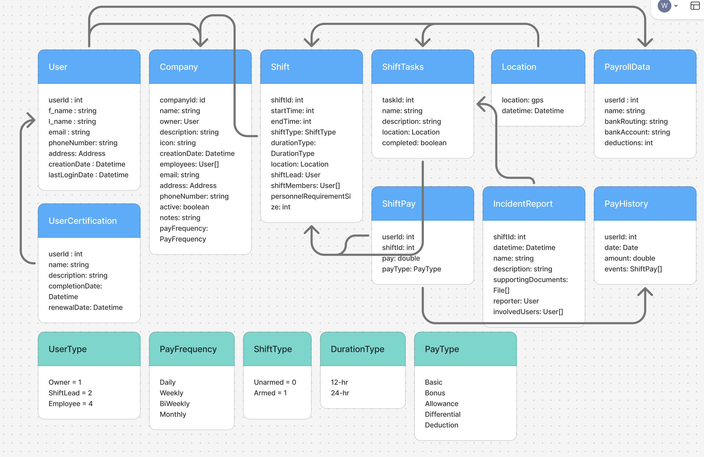
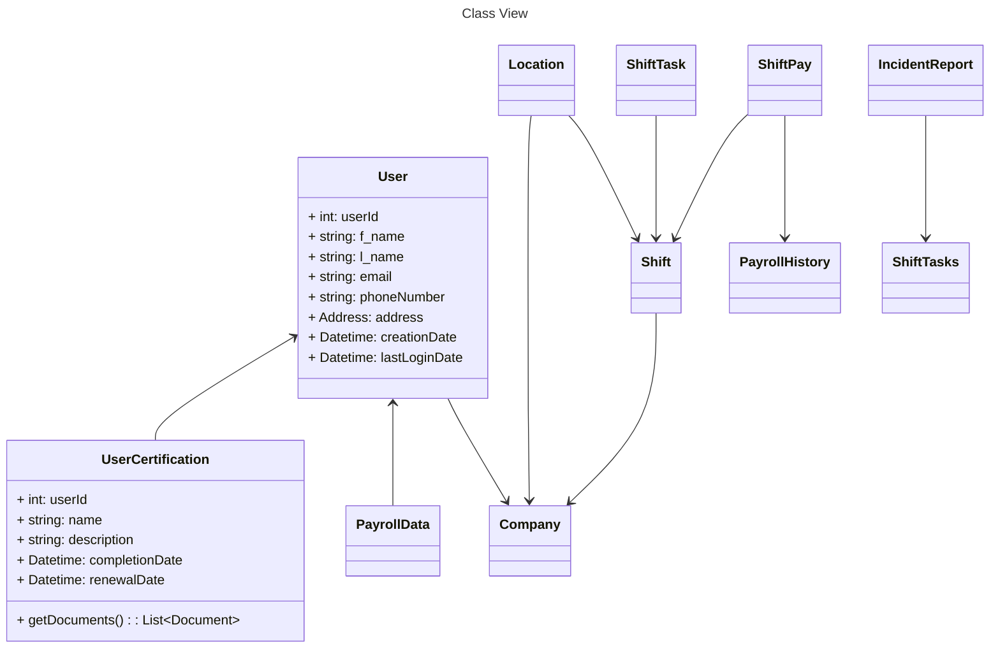

# Class View

Definining Class Information initially was done in Figma which will be expanded upon.

## Figma Design

## Mermaid Designs

While the above Figma designs are useful and clean, they are not able to effectively track changes effectively if we want to change definitions over time. This is where Mermaid is more effective.

